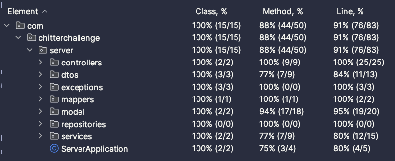

Chitter Challenge (Spring Boot Edition)
=======================================

### About The Project

The Chitter Challenge is a project that was done on the final 2 weeks of the academy. The task 
was to create a full stack application, which is essentially a clone of Twitter/X, using the MERN stack 
&mdash; MongoDB, Express.js, React, Node.js.

This version would be the JRM stack (sadly not as catchy :( as MERN).

### Requirements

- Post a message (peep)
- See all peeps in reverse chronological order
- See the time at which it was made
- Sign up
- Log in

### Developed With

This project is developed using the following frameworks and libraries:

<ul>
    <li><a href="https://www.java.com/en/download/help/whatis_java.html">Java 17</a></li>
    <li><a href="https://spring.io/projects/spring-boot">Spring Boot 3.2.3</a></li>
    <li><a href="https://www.mongodb.com/">MongoDB </a></li>
    <li><a href="https://junit.org/junit5/">JUnit</a></li>
    <li><a href="https://maven.apache.org/">Maven</a></li>
</ul>

## Getting Started

### Prerequisite

You will need to have mongodb-community running first. For Mac, run:
```
brew services start mongodb-community
```

### Get the code

As the project is split into repo (backend and frontend), 
you will have to clone two repos.\

For the Spring Boot backend:
```
git clone https://github.com/Saphly/chitter-challenge-java
```

For the frontend:
```
git clone https://github.com/Saphly/chitter-challenge-mirrored 
```

### Front-end

If you are in the root directory of this project, run
```
cd chitterFrontEnd && npm i
npm run dev
```

### Back-end

Run ServerApplication from your preferred Java IDE. 

### Using the app

As you will be starting off with a completely empty project, you can follow these steps to create a new user and post some peeps!

<ol>
    <li>Click on the Login button on the header</li>
    <li>Click on "Click here to register"</li>
    <li>Fill in your details (email, password, name and username) and click register</li>
    <li>Once you are registered, go back and login with your details</li>
    <li>Post some peeps!</li>
</ol>

### API Endpoints

`GET` `/peep/all`\
Get all peeps in reverse chronological order. 
```
[
    {
        "id": "65e6455052a8ff36e2a8e83a",
        "username": "JD",
        "name": "John Doe",
        "dateCreated": "2024-03-04T22:04:00.675Z",
        "peep": "first peep!"
    }
]
```

`POST` `/peep/post` 
```
JSON request body
{
    "username": "JD",
    "name": "John Doe",
    "dateCreated": "2024-03-05T15:20:27.371Z",
    "peep": "3rd peep"
}

API return
{
    "id": "65e7383bb37db834eaae2ca8",
    "username": "JD",
    "name": "John Doe",
    "dateCreated": "2024-03-05T15:20:27.371Z",
    "peep": "3rd peep"
}
```

`POST` `/user/login`
```
JSON request body
{
    "email": "john@example.com",
    "password": "asd"
}

API return 
{
    "message": "Login success",
    "user": {
        "name": "John Doe",
        "username": "JD"
    }
}
```

`POST` `/user/register`
```
JSON request body
{
    "name": "John Doe",
    "username": "JD",
    "password": "asd",
    "email": "john@example.com"
}

API return
{
    "message": "Register success",
    "user": {
        "name": "John Doe",
        "username": "JD2"
    }
}

```

## Reflection: 
Even though this is just a simple backend server, I have actually spent a good amount of time on this, and it 
was a great learning experience. As I had little experience in `Java` and `Spring Boot`, as well as using a
new IDE `IntelliJ IDEA`, it was a steep learning curve for me and there is much to improve on for my coding 
practices in Jaya. 

There are a few features/improvements that I would like to work on:
- Implement JSON Web Token (JWT) for security 
- Unit tests in addition to the integration tests
- Update and delete peep functionality
- Better way of creating JSON request body for tests 

